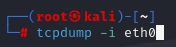
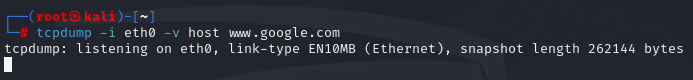
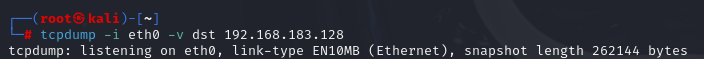
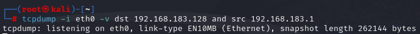
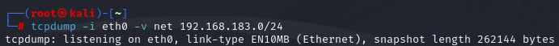
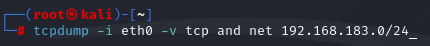
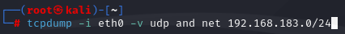
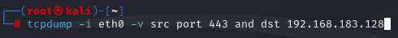
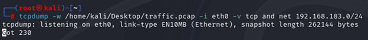
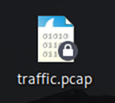

# TCPDump-Network-Traffic-Analysis

This project focuses on using TCPDump to capture and analyze network traffic across different layers of the OSI model. TCPDump is a powerful command-line tool that allows us to monitor and inspect network packets in real-time.

**Introduction**

TCPDump is a widely-used network sniffing tool that enables users to capture and analyze data traffic from any layer of the OSI model. In this project, we explore basic and advanced usage of TCPDump, including applying filters to narrow down traffic, capturing specific types of data, and exporting results for further analysis.

## Skills Acquired

- **Network Traffic Analysis: Gained hands-on experience in capturing and analyzing network traffic using TCPDump.**
- **Filtering Techniques: Learned to apply various filters to narrow down traffic based on host, destination, protocol, and port.**
- **Subnet Scanning: Explored how to capture traffic across an entire subnet.**
- **Data Exporting: Practiced exporting captured data into .pcap files for further analysis in tools like Wireshark.**
- **Command-Line Proficiency: Improved command-line skills by working with TCPDump and its options.**

## Documentation

**Basic Usage**

To start capturing network traffic, you can use the following command:

```sh
tcpdump -i eth0
```


- -i: Specifies the interface to capture traffic from (e.g., eth0 for Ethernet or wlan0 for Wi-Fi).

This command captures all traffic on the specified interface, which can result in a large amount of data. To make the output more manageable, we can apply filters.

### Applying Filters

**Filter by Host**

To capture traffic from a specific host, use:

```sh
tcpdump -i eth0 host <IP_ADDRESS> -v
```


host: Filters traffic by a specific IP address.

-v: Provides verbose output for detailed information.

**Filter by Destination**

To capture traffic destined for a specific IP address:

```sh
tcpdump -i eth0 dst <IP_ADDRESS>
```


**Combine Filters**

You can combine filters to refine your capture. For example:

```sh
tcpdump -i eth0 host <IP_ADDRESS> and dst <DESTINATION_IP>
```


**Scan an Entire Subnet**
   
To capture traffic for an entire subnet, specify the subnet mask:

```sh
tcpdump -i eth0 net <NETWORK_ADDRESS>/<SUBNET_MASK>
```


**Filter by Protocol**
   
To capture only TCP or UDP traffic:

```sh
tcpdump -i eth0 tcp
tcpdump -i eth0 udp
```



**Filter by Port**

To capture traffic from a specific port:

```sh
tcpdump -i eth0 port <PORT_NUMBER>
```


### Exporting Captured Data

To save captured packets for later analysis (e.g., in Wireshark), use the -w option to generate a .pcap file:

```sh
tcpdump -i eth0 -w output.pcap
```



This file can then be opened in tools like Wireshark for further inspection.

## Conclusion

This project provided a solid foundation in network traffic analysis using TCPDump. By applying filters and exporting data, we can efficiently monitor and inspect network activity, making it a valuable skill for network administrators and security professionals.
